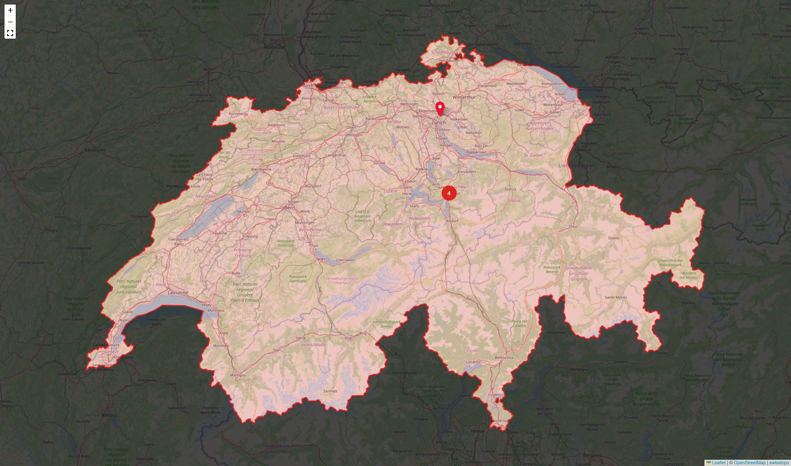

# devmap.ch



## SHP to GeoJSON

- Download the SHP from [swisstopo](https://www.swisstopo.admin.ch/en/landscape-model-swissboundaries3d)
- Extract the country borders: `*_LANDESGEBIET.shp`, `*_LANDESGEBIET.dbf`, `*_LANDESGEBIET.shx`
- Convert to GeoJSON on mygeodata.cloud (coordinate system: `LV95 LN02`)
- Download and rename to `ch-3d.geojson`
- Delete all height information (the third coordinate in each coordinate array) with:

    ```
    jq 'walk(if type == "array" and length == 3 and all(type == "number") then [.[0], .[1]] else . end)' ch-3d.geojson > ch-2d.geojson
    ```

- Manually remove Germany, Liechtenstein and Italia from `ch-2d.geojson`
- Halve the number of coordinates of each ring with:

    ```
    jq '.features[0].geometry.coordinates = [.features[0].geometry.coordinates[] | [.[range(0; length; 2)]]]' ch-2d.geojson > ch-2d-half.json
    ```

Saving it as json makes the `import` statement automatically parse it.